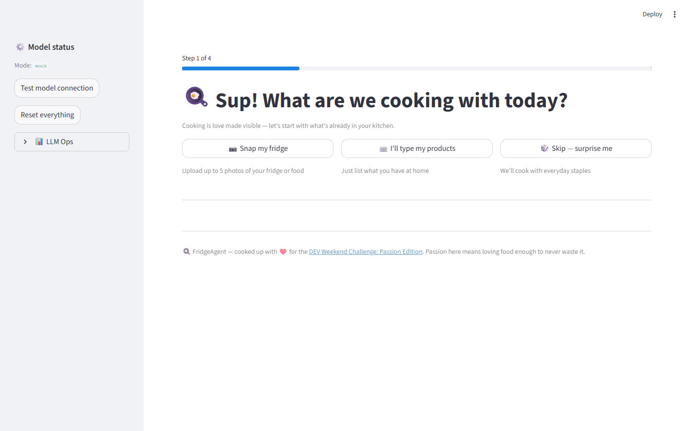
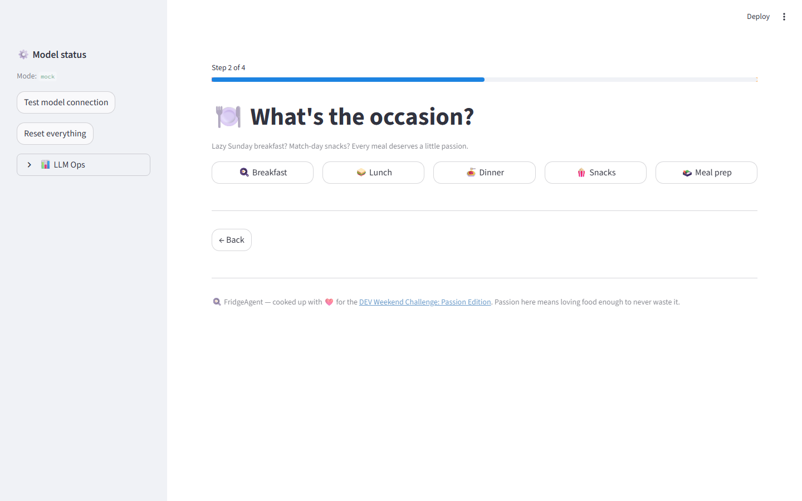
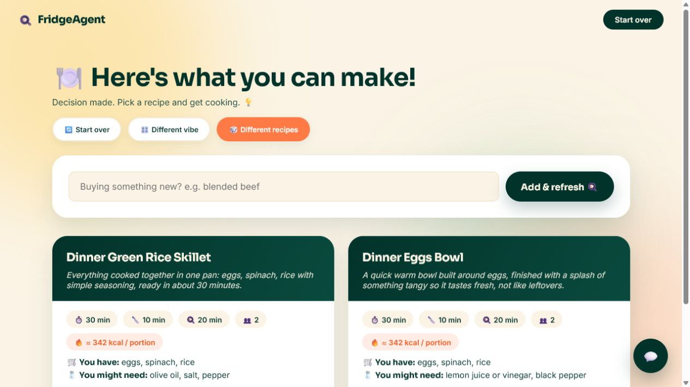
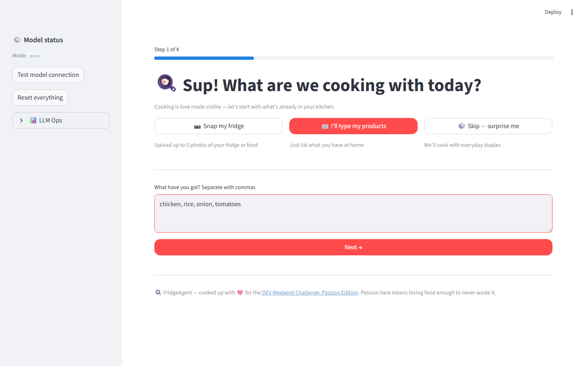
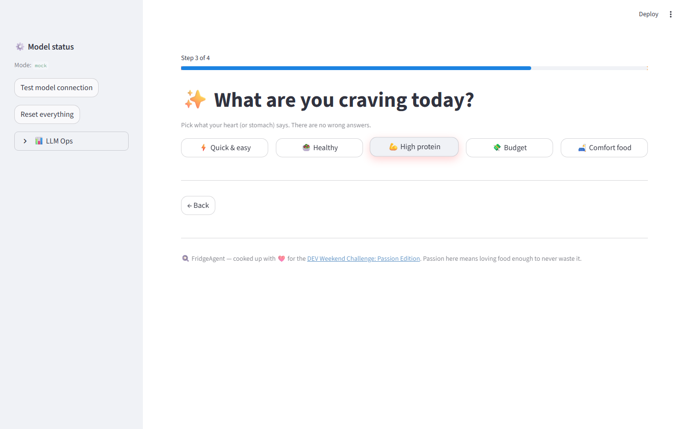
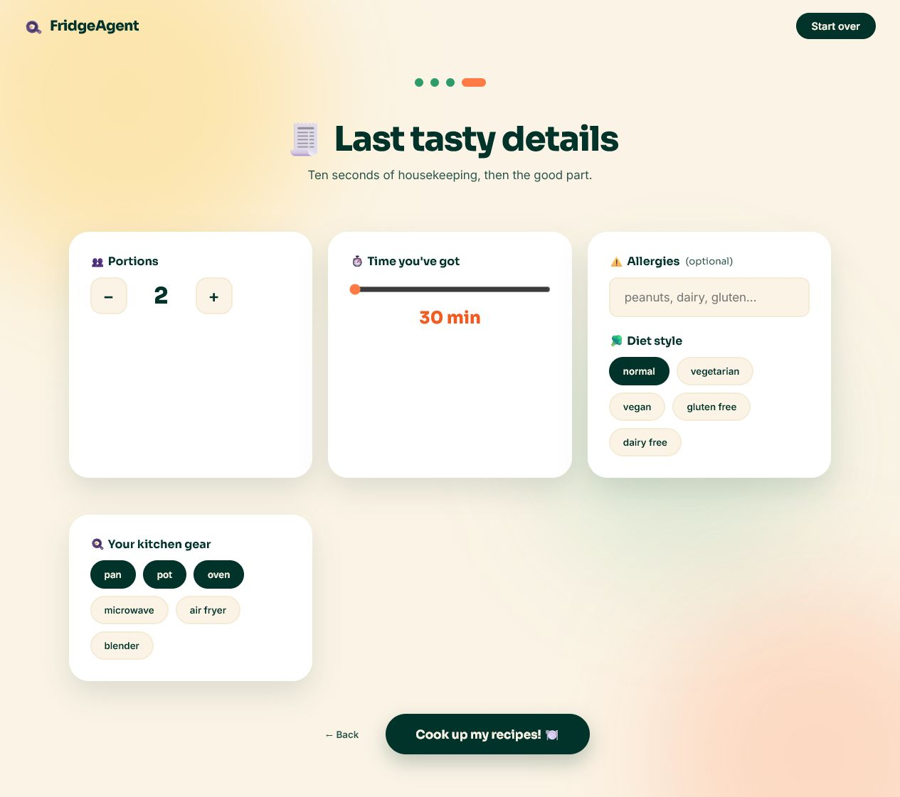
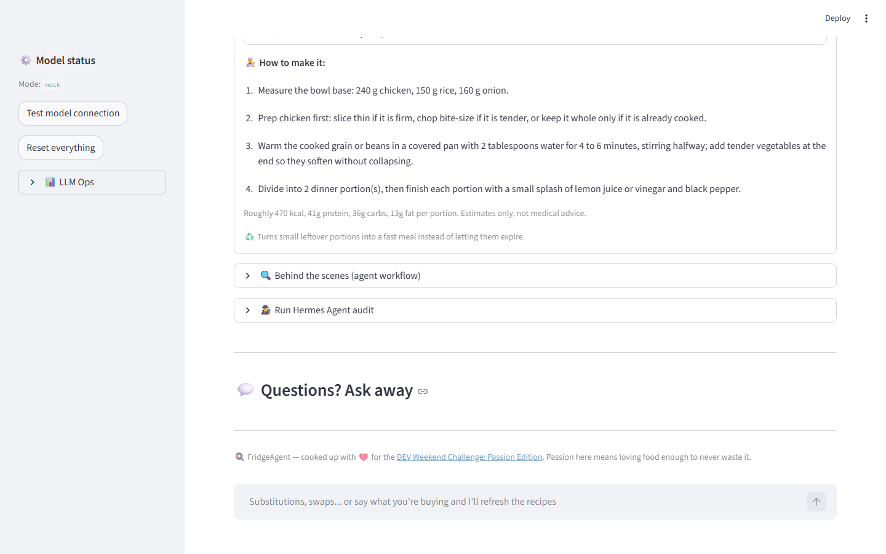

# 🍳 FridgeAgent

**Spend less time deciding what to cook and get straight to the good part.**

Snap photos of your fridge, answer three friendly questions, and a four-agent AI
workflow handles the meal-idea thinking and turns what you actually have into
real, cookable recipes — with exact amounts, estimated calories per portion,
and steps a tired human can follow at 9pm.

Built up for the [DEV Weekend Challenge: Passion Edition](https://dev.to/challenges/weekend-2026-07-09).
Our take on passion: love the cooking, not the deciding — FridgeAgent saves
your time and mental energy so you can get straight to the pan.

**Challenge:** [DEV Weekend Challenge: Passion Edition](https://dev.to/challenges/weekend-2026-07-09)

[](https://fridgeagent-30975867572.europe-north1.run.app)



## Live Demo

**Try it now:** [https://fridgeagent-30975867572.europe-north1.run.app](https://fridgeagent-30975867572.europe-north1.run.app)

The public demo runs on Google Cloud Run and calls Vertex AI through a scoped
service account—there is no API key in the repository, container, or browser.
It uses `gemini-2.5-flash`, is capped at two instances, and scales to zero when
idle.

## Run It (One Command)

Double-click **`run.bat`**. That's the whole setup:

1. Creates the virtual environment and installs dependencies (only when
   `requirements.txt` changed).
2. Starts Ollama in the background if it isn't running; pulls the models on
   first use.
3. Falls back to Google Gemini (if `GOOGLE_API_KEY` is set) or mock mode when
   no local model is available — the app always starts.
4. Opens the wizard in your browser.

Optional: `run.bat --mock`, `run.bat --google`, `run.bat --local`.

## The Flow

1. **"Sup! What are we cooking with today?"** — 📷 snap your fridge, ⌨️ type
   your products, or 🎲 skip and cook with staples
2. **"What's the occasion?"** — breakfast / lunch / dinner / snacks / meal prep
3. **"What are you craving?"** — quick & easy / healthy / high protein / budget / comfort food
4. Ten seconds of details → **recipe cards**: description, time chips,
   estimated calories per portion, "you already have / you might need", and
   numbered plain-language steps
5. Tell the chat *"I'm buying blended beef"* → the cards refresh in place with
   recipes built around blended beef. Or hit **🎲 Show me different recipes**
   for a fresh batch from the same fridge.

| Pick the occasion | Get your recipes |
|---|---|
|  |  |

<details>
<summary>📸 More screenshots</summary>






</details>

---

## The Journey

This project was rebuilt over one weekend, and almost nothing went according to
plan. Here's what actually happened — the bugs, the evidence, and the fixes —
because the debugging turned out to be the most interesting part.

### Chapter 1: "Nothing happens"

First real test: pick ingredients, click **Generate recipes**... nothing.
No error, no recipes, no clue.

It turned out to be *three* stacked problems:

- **Results vanished on rerun.** Recipe cards only rendered during the submit
  event; any later interaction re-ran the Streamlit script and wiped them.
  Fix: results live in `session_state` and render on every run.
- **The debug monitor was killing the run.** Our live agent-trace panel
  re-sent full RAG dumps and model outputs over the websocket on *every*
  workflow event. Big payloads froze the browser tab, the websocket dropped,
  and Streamlit silently killed the script mid-workflow — recipes were being
  generated and thrown away. Fix: monitor payloads are compacted (capped
  lists, truncated strings); full data stays in the "Agent outputs" expander.
- **Timeouts pretending to be results.** Local model calls were capped at a
  hardcoded 120s while photo analysis alone measured ~63s. The timeout was
  caught, swallowed, and surfaced as "zero ingredients found". Fix:
  `OLLAMA_TIMEOUT_SECONDS` (default 300) and a loud, specific error state in
  the UI with an inline "type your products instead" recovery box.

**Lesson:** a silent failure path is a lie you tell your future self.

### Chapter 2: The photos that died between steps

With the wizard UI, users pick photos on step 1 and generate on step 4.
Detection kept coming back empty — and telemetry (see below) showed why:

```json
{"image_bytes": 0, "latency_ms": 11036, "raw_response_chars": 60, "ingredient_count": 0}
```

Zero image bytes. Streamlit frees uploaded file data the moment the uploader
widget leaves the screen — so by step 4, the photos were gone and the model was
politely analyzing *nothing*. Fix: copy the raw bytes into session state the
moment photos are picked ("N photo(s) locked in ✅").

**Lesson:** know your framework's widget lifecycle before building a wizard on it.

### Chapter 3: The model that hallucinated a fridge

The scariest bug, because it looked like success. Early on, photo detection
returned a lovely list: milk, eggs, butter, deli meat... Except those weren't
in the photo. The telemetry made the pattern obvious:

| | Real analysis | Our runs |
|---|---|---|
| Latency | ~63s | 11–26s |
| Response size | ~2,700 chars | 60–200 chars |
| Detections | 8 items | 0 items (or invented ones) |

Direct API tests confirmed it: `gemma4:e4b`'s vision path in Ollama decodes the
image (the server logs literally say `image decoded in 93ms`) but the
embeddings never reach the language model, which answers "no image provided" —
or worse, **invents a statistically plausible fridge**. Re-pulling the model
didn't help; no Ollama update was available.

The fix that worked, verified on 8 real test photos (0/8 detected before, **8/8 after**, 5–12s each):

- **A dedicated vision model** — `VISION_MODEL_NAME=llava:7b` handles photos
  while `gemma4:e4b` keeps writing recipes (it's genuinely good at that).
  `run.bat` pulls it automatically.
- **`format=json`** — Ollama constrains the output to valid JSON, because
  vision models freestyle otherwise.
- **A tolerant parser** — a 7B vision model will not fill a deeply nested
  schema. The prompt asks for a flat shape and the parser fills in
  category/quantity/confidence defaults, instead of throwing away a correct
  answer because it came in the wrong outfit.

**Lesson:** "the model returned something" is not the same as "the model saw
your image". Log enough to tell the difference.

### Chapter 4: The same two recipes, forever

Refreshing with the same ingredients produced the same recipes — technically
correct, emotionally deflating. And newly added products ("I'm buying blended
beef!") got tossed into the ingredient pool and promptly ignored.

Fixes:

- The planner runs in **creative mode** (temperature 0.95 + random seed), so
  identical inputs stop producing identical outputs.
- Every refresh passes the **previously shown titles** back with an explicit
  *"do not repeat these — change technique or cuisine"* instruction.
- Added products are marked **must-use**: *"every recipe MUST use them as a
  central ingredient, not a garnish"*, and they lead the ingredient list so
  even the deterministic fallback recipes anchor on them.

Verified live: pasta/eggs/parmesan/onion gave *"Creamy Onion & Parmesan Pasta
Scramble"* and *"Cheesy Onion Pasta Bake"*; refreshing with blended beef gave
*"Inside Out Ravioli Skillet"* and *"Blended Beef Bowl"* — no repeats, beef
front and center in both.

### What kept us honest: telemetry

Every one of these bugs was found or confirmed with a tiny LLM-ops layer the
app runs automatically (git-ignored JSONL, no setup):

- `data/telemetry/vision_detection.jsonl` — per photo: latency, image bytes,
  JSON parse success, ingredient count, confidence min/mean/max
- `data/telemetry/rag_retrieval.jsonl` — per search: latency, index size, hit
  count, top score

Three ways to look at it:

1. **📊 LLM Ops panel** in the app sidebar (live summaries)
2. `python scripts/llm_ops_report.py --check` — full report; exits non-zero
   when performance budgets are violated
3. **CI** (`.github/workflows/ci.yml`) — every push runs the 54-test suite
   (including RAG correctness + latency budget against a committed fixture
   index) plus the budget check, and uploads the run's telemetry as an
   artifact so retrieval performance is comparable between commits

---

## Under the Hood

FridgeAgent is not one big recipe prompt. It is a bounded four-agent workflow
where each specialist owns one part of the decision: image understanding and
ingredient verification, constraint normalization, RAG-grounded recipe
planning with portion math and rough nutrition ranking, and final allergy-safe
recipe card writing.

```text
Photos / typed products
   -> Vision Agent        (detect, merge, flag low-confidence for confirmation)
   -> Constraints Agent   (portions, time, allergies, diet, tools)
   -> Recipe Planner      (RAG retrieval, portion math, feasibility repair)
   -> Final Recipe Agent  (allergen filtering, final cards)
   -> Recipe cards + optional external Hermes Agent audit
```

### Why Hermes, and what it improved

Handoffs are controlled by `HermesOrchestrator`
([src/orchestration/hermes.py](src/orchestration/hermes.py)) — a deterministic
Python message-passing layer, **not another LLM**. That is a deliberate choice.

The obvious multi-agent design is to let a model decide which agent runs next.
We tried the obvious design's failure modes so you don't have to imagine them:
an LLM router adds a full model call *per handoff* (on a local 8B model that's
30–60 seconds of pure overhead per hop), it occasionally re-runs stages or
skips them, and when something breaks you're debugging a conversation instead
of a call stack.

Hermes replaces all of that with boring, fast Python:

- **Fixed four-stage order** — vision → constraints → planner → final writer.
  No stage can run twice, no loops are possible by construction.
- **Zero routing latency** — handoffs cost microseconds, so the only model
  time spent is on actual work (seeing food, planning recipes). In practice
  this cut a full local run from "several minutes, sometimes" to a
  predictable ~60–90s dominated by the planner call.
- **Clean payloads** — each stage receives only the structured data it needs
  (the planner never sees raw photos; the final writer never sees RAG dumps),
  which keeps prompts small and inside the local model's context window.
- **A hard safety gate** — if no ingredients can be verified, Hermes stops the
  pipeline. The planner is never allowed to invent what's in your fridge.
- **An inspectable trace** — every handoff is recorded and shown in the
  "Behind the scenes" expander, which is how the bugs in the journey above
  were localized to specific stages instead of "somewhere in the AI".

There's also a second, separate Hermes: an optional **external audit layer**
that calls the Nous Research Hermes Agent CLI (`hermes chat -Q -q`) with the
generated workflow JSON, acting as an independent critic that checks whether
the recipes can physically be cooked — portion math, missing binders/bases,
allergy risks. The orchestrator controls the workflow; the audit questions its
output. (If the CLI isn't installed, the app shows setup guidance and a
deterministic fallback audit instead.)

Safety details we care about: ingredients detected below 0.5 confidence are
never cooked with silently — the app asks you to confirm them ("possibly
chicken (0.30)" becomes a question, not a dinner). Allergen conflicts remove
recipes entirely, and packaged-ingredient warnings are added for hidden
allergens.

**Recipe RAG:** the planner grounds its ideas in a compact local index sampled
from the Kaggle `recipe-dataset-over-2m` dataset (~25k records, lexical
scoring, ~0.8s mean retrieval). Build it with:

```powershell
.\.venv\Scripts\python.exe scripts\download_recipe_dataset.py
.\.venv\Scripts\python.exe scripts\build_recipe_rag_index.py --dataset-path "PATH_PRINTED_BY_DOWNLOAD" --limit 25000
```

The app works without the index — recipes are just less varied. The dataset is
not included in this repository. It is licensed separately under
[CC BY-NC-SA 4.0](https://creativecommons.org/licenses/by-nc-sa/4.0/) with
additional terms on its
[Kaggle dataset page](https://www.kaggle.com/datasets/wilmerarltstrmberg/recipe-dataset-over-2m);
review those terms before downloading or using it.

## Modes

| Mode | What it does |
|---|---|
| `APP_MODE=local` (default) | Recipes via `GEMMA_MODEL_NAME` (`gemma4:e4b`), photos via `VISION_MODEL_NAME` (`llava:7b`), both through Ollama |
| `APP_MODE=google` | Google Gen AI SDK for both image and text. Local key mode defaults to `gemini-3.5-flash`; the keyless Cloud Run deployment uses Vertex AI with `gemini-2.5-flash` and service-account authentication |
| `APP_MODE=mock` | Deterministic demo flow, no model calls at all |

Copy `.env.example` to `.env` to configure. Manual start, if you prefer it over
`run.bat`:

```powershell
python -m venv .venv
.venv\Scripts\Activate.ps1
pip install -r requirements.txt
streamlit run main.py
```

## Deploy on Google Cloud Run

**Current deployment:** [open FridgeAgent](https://fridgeagent-30975867572.europe-north1.run.app) · project `fridge2fork-502221` · region `europe-north1` · model `gemini-2.5-flash`

The repository includes a production `Dockerfile` and explicit Cloud Run
ignore rules. The recommended deployment uses the Cloud Run service identity
to call Vertex AI, so no API key is stored or sent to the browser.

Prerequisites: a Google Cloud project with billing enabled and the Google Cloud
CLI. The commands below keep build and runtime permissions separate: the build
identity gets Cloud Run Builder, while the runtime identity gets Vertex AI
User.

```powershell
$PROJECT_ID = "your-google-cloud-project-id"
$REGION = "europe-north1"
$RUNTIME_ACCOUNT = "fridgeagent-run@$PROJECT_ID.iam.gserviceaccount.com"
$BUILD_ACCOUNT = "fridgeagent-build@$PROJECT_ID.iam.gserviceaccount.com"
$DEPLOYER_ACCOUNT = (gcloud config get-value account)

gcloud auth login
gcloud config set project $PROJECT_ID
gcloud services enable run.googleapis.com cloudbuild.googleapis.com artifactregistry.googleapis.com aiplatform.googleapis.com

gcloud iam service-accounts create fridgeagent-run --display-name="FridgeAgent Cloud Run"
gcloud iam service-accounts create fridgeagent-build --display-name="FridgeAgent Cloud Build"

gcloud projects add-iam-policy-binding $PROJECT_ID `
  --member="serviceAccount:$RUNTIME_ACCOUNT" `
  --role="roles/aiplatform.user"

gcloud projects add-iam-policy-binding $PROJECT_ID `
  --member="serviceAccount:$BUILD_ACCOUNT" `
  --role="roles/run.builder"

gcloud iam service-accounts add-iam-policy-binding $BUILD_ACCOUNT `
  --member="user:$DEPLOYER_ACCOUNT" `
  --role="roles/iam.serviceAccountUser"

gcloud run deploy fridgeagent `
  --source . `
  --build-service-account "projects/$PROJECT_ID/serviceAccounts/$BUILD_ACCOUNT" `
  --region $REGION `
  --allow-unauthenticated `
  --service-account $RUNTIME_ACCOUNT `
  --set-env-vars "APP_MODE=google,GOOGLE_GENAI_USE_VERTEXAI=true,GOOGLE_CLOUD_PROJECT=$PROJECT_ID,GOOGLE_CLOUD_LOCATION=global,GOOGLE_MODEL_NAME=gemini-2.5-flash" `
  --memory 1Gi `
  --concurrency 4 `
  --max-instances 2 `
  --timeout 300
```

For a public demo, set conservative Vertex AI quotas and billing alerts before
sharing the URL. `--max-instances 2` limits Cloud Run scaling but does not cap
Vertex AI spend. If the app should be private, remove
`--allow-unauthenticated`.

## Tests

```powershell
pytest
```

54 tests: agent workflow in mock mode, RAG retrieval correctness and latency
budgets, telemetry collection, Google AI client, JSON parsing edge cases, and
the primary web experience's decision-time and calories-per-portion copy.

## Limitations

- Nutrition values are rough estimates, not medical advice.
- Local photo analysis takes ~5–12s per photo; local recipe generation ~60–90s.
- The RAG index is a compact sample for speed, not the full 2M-recipe dataset.
- Mock mode cannot inspect images — type your products instead.

## Future Improvements

- Replace rough nutrition heuristics with an optional, clearly sourced food
  nutrition dataset while keeping every value labeled as an estimate.
- Add a lightweight ingredient-confirmation screen for ambiguous photo items.
- Package a small redistributable RAG starter index for more varied recipes on
  the first run.

## Disclosure

The four-agent core (vision, constraints, planner, final recipe writer)
predates the Passion Edition challenge and was originally built for an earlier
challenge. The challenge-weekend work: the four-step wizard UI, the
one-command launcher, the LLM telemetry + ops report + CI pipeline, the entire
vision debugging saga and dedicated-vision-model fix, recipe variety on
refresh, must-use added products, chat-triggered recipe refreshes, and the
Google AI provider.

## License

FridgeAgent's source code and original project assets are available under the
[MIT License](LICENSE). Third-party packages and the optional recipe dataset
remain under their own licenses; see [THIRD_PARTY_NOTICES.md](THIRD_PARTY_NOTICES.md).
